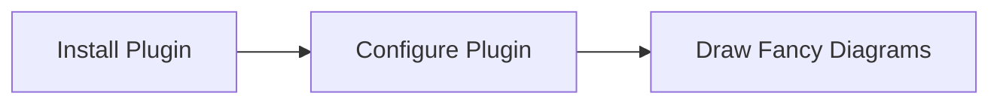

## Guide

(Gatsby Carbon MDX Guide)[https://gatsby-theme-carbon.now.sh/guides/MDX]

## Task

This should start with a resource description…

`This is some important note.`

```
GET https://api.video.ibm.com/channels/{channel_id}.json
```

### Parameters

This request has no parameters.

`-OR-`

The query parameters for the GET request:

| PARAMETER  | TYPE    | IMPORTANCE | DESCRIPTION                                           |
| ---------- | ------- | ---------- | ----------------------------------------------------- |
| `page`     | integer | OPTIONAL   | Requested page number (value is 1 by default)         |
| `pagesize` | integer | OPTIONAL   | Requested page size (value is 50 by default, max. 50) |

`-OR-`

The parameters for the PUT request:

| PARAMETER | TYPE    | IMPORTANCE | DESCRIPTION |
| --------- | ------- | ---------- | ----------- |
| `param1`  | string  | REQUIRED   |             |
| `param2`  | integer | OPTIONAL   |             |

### Success response

For this request an empty response is returned.

`-OR-`

On success, a response with HTTP status "`200 OK / 201 Created / 202 Accepted / 204 No Content`" is returned.

`-OR-`

On success a response with HTTP status “200 OK” is returned with the following key-value pairs under a `channel` key.

`-OR-`

On success a response with HTTP status “200 OK” is returned with an array under a `captions` key. The elements of the array contain the following key-value pairs for each `caption`:

| KEY           | TYPE    | DESCRIPTION                                                                                                             |
| ------------- | ------- | ----------------------------------------------------------------------------------------------------------------------- |
| `key1`        | string  |                                                                                                                         |
| `key2`        | number  |                                                                                                                         |
| `key3`        | boolean |                                                                                                                         |
| `key4`        | object  | A set of key-value pairs containing information about `key4 settings` with the following attributes: `child1`, `child2` |
| `key4.child1` | string  |                                                                                                                         |
| `key4.child2` | number  |                                                                                                                         |
| `key5`        | array   |                                                                                                                         |

Example for success response:

```json
{ "success": true }
```

### Error responses

Possible error responses:

| HTTP RESPONSE CODE      | ERROR VALUE    | ERROR CONDITIONS                                                                        |
| ----------------------- | -------------- | --------------------------------------------------------------------------------------- |
| 401 Unauthorized        | `unauthorized` | The provided access token is missing, revoked, expired or malformed                     |
| 404 Not Found           | `not_found`    | Channel was not found                                                                   |
| 503 Service Unavailable |                | There is a temporary error on the server which makes it impossible to serve the request |

`(^ minimal) – OR – (with all possible codes v )`

Possible error responses:

| HTTP RESPONSE CODE      | ERROR VALUE              | ERROR CONDITIONS                                                                        |
| ----------------------- | ------------------------ | --------------------------------------------------------------------------------------- |
| 400 Bad Request         | `input_validation_error` | Validation failed                                                                       |
| 401 Unauthorized        | `invalid_token`          | The provided access token is missing, revoked, expired or malformed                     |
| 402 Payment Required    | `invalid_request`        | The user does not have the benefit                                                      |
| 403 Forbidden           | `lack_of_ownership`      | The API user is not allowed to manage the given channel                                 |
| 404 Not Found           | `not_found`              | Channel was not found                                                                   |
| 503 Service Unavailable |                          | There is a temporary error on the server which makes it impossible to serve the request |

<AnchorLinks>
  <AnchorLink>Site metadata</AnchorLink>
  <AnchorLink>Manifest</AnchorLink>
  <AnchorLink>Favicon</AnchorLink>
  <AnchorLink>Additional font weights</AnchorLink>
  <AnchorLink>Image compression</AnchorLink>
  <AnchorLink>Global search</AnchorLink>
  <AnchorLink>Edit on Github link</AnchorLink>
  <AnchorLink>Medium</AnchorLink>
  <AnchorLink>Other options</AnchorLink>
</AnchorLinks>

## Site metadata

To add a title and description to each page, simply provide them to siteMetadata in your `gatsby-config.js` file.

The language attribute applied to the `<html>` tag on every page is English (`en`) by default, but you can choose to override this. For more information on declaring the language of a page in HTML, please review [W3 Criterion 3.1.1 Language of a Page](https://www.w3.org/WAI/WCAG21/Understanding/language-of-page).

```js
module.exports = {
  siteMetadata: {
    title: 'Gatsby Theme Carbon',
    description: 'A Gatsby theme for the carbon design system',
    keywords: 'gatsby,theme,carbon',
    lang: 'en',
  },
  plugins: ['gatsby-theme-carbon'],
};
```

## Manifest

One of the first configurations should be to override the default manifest options, you can do this in `gatsby-config.js`. Any options you don’t set, will be provided by the theme. See the example project.

```js
siteMetadata: {
    title: 'Gatsby Theme Carbon',
  },
  plugins: [
    'gatsby-theme-carbon',
    {
      resolve: 'gatsby-plugin-manifest',
      options: {
        name: 'Carbon Design Gatsby Theme',
        short_name: 'Gatsby Theme Carbon',
        start_url: '/',
        background_color: '#ffffff',
        theme_color: '#0062ff',
        display: 'browser',
      },
    },
  ],
```

## Favicon

If you need to override the default favicon, you can do so by passing a relative path to the icon. It’s recommended to provide a 512 x 512 version.

**IMPORTANT:** For best results, if you’re providing an icon for generation it should be…

- at least as big as the largest icon being generated (512x512 by default).
- square (if it’s not, transparent bars will add to make it square).
- of one of the follow formats: JPEG, PNG, WebP, TIFF, GIF or SVG.

```js
plugins: [
    {
      resolve: 'gatsby-theme-carbon',
      options: {
        iconPath: './src/images/custom-icon-512.png'
      },
    },
  ],
```

## Additional font weights

If needed, you can add support for additional Plex font weights. Don’t forget to specify italics for the additional weights if needed.

```js
plugins: [
    {
      resolve: 'gatsby-theme-carbon',
      options: {
		// will get added to default [300, 400, 600]
        additionalFontWeights: ['200', '200i]
      },
    },
  ],
```

## Image compression

You can enable WebP by passing `withWebp: true` or providing your own optimization level. See the gatsby-remark-images [plugin options](https://www.gatsbyjs.org/packages/gatsby-remark-images/#options). You can also tweak the image quality based on design tolerance and performance thresholds.

```js
module.exports = {
  plugins: [
    {
      resolve: 'gatsby-theme-carbon',
      options: {
        withWebp: true, // true, false (default false)
        imageQuality: 50, // 0-100 (default 75)
      },
    },
  ],
};
```

## Global search

Site-wide search is provided by the theme. The only requirement for a page to show up in the results is for it to have `title` set in the [frontmatter](/components/MDX#frontmatter).
To render more helpful search results (and improve SEO), you’ll want to make sure your pages have `description` set in the frontmatter as well.

Global search is enabled by default. To disable it, set the `isSearchEnabled` option to false.

```js
  plugins: [
    {
      resolve: 'gatsby-theme-carbon',
      options: {
        isSearchEnabled: false
      },
    },
  ],
```

Under the hood, we use [Lunr](https://lunrjs.com/) to create our search index. If necessary, you tweak the search scoring algorithm and source nodes.
To do so, provide your own [resolvers object](https://www.gatsbyjs.org/packages/gatsby-plugin-lunr/#getting-started) to the `lunrOptions` theme option.

## Edit on GitHub link

To add a link to the bottom of each page that points to the current page source in GitHub, provide a `repository` object to `siteMetadata` in your `gatsby-config.js` file. You can provide a `baseUrl`, and if needed, the `subDirectory` and `branch` where your site source lives.

```js
  plugins: [
    {
      resolve: 'gatsby-theme-carbon',
      options: {
        repository: {
          baseUrl: 'https://github.com/carbon-design-system/gatsby-theme-carbon',
          subDirectory: '/packages/example',
          branch: 'master',
        },
      },
    },
  ],
```

## Medium

In order to change the source account for the [`MediumPosts`](/components/MediumPosts) component, provide an account with the `mediumAccount` option.

```js
plugins: [
  {
    resolve: 'gatsby-theme-carbon',
    options: {
      mediumAccount: 'carbondesign',
    },
  },
];
```

## Other options

- `additionalFontWeights` – add support for additional Plex font weights. Don’t forget to specify italics for the additional weights if needed.
- `mdxExtensions` – change the file extensions processed by `gatsby-mdx` (default ['.mdx', '.md']).
- `pngCompressionSpeed` - a speed/quality trade-off from 1 (brute-force) to 10 (fastest). Speed 10 has 5% lower quality, but is 8 times faster than the default (4).
- `titleType` – pick between four formats for the `<title>` element for your site. Here are the four options using this page as an example:

  - `page`: "Configuration" (default)
  - `site`: "Gatsby Theme Carbon"
  - `append`: "Gatsby Theme Carbon – Configuration"
  - `prepend`: "Configuration - Gatsby Theme Carbon"

```js
plugins: [
    {
      resolve: 'gatsby-theme-carbon',
      options: {
        additionalFontWeights: ['200', '200i'],
        mdxExtensions: ['.mdx'],
        titleType: 'append'
      },
    },
  ],
```

## Additional remark plugins and override existing remark plugin configuration

- `gatsbyRemarkPlugins` - An array containing gatsby remark plugin configurations to be added/overridden.

### Example [Gatsby Remark Mermaid plugin](https://www.gatsbyjs.org/packages/gatsby-remark-mermaid/)

For the below markdown snippet:

````

````

to turn into an image one should add the following configuration to her/his own project:

```js
 plugins: [
    {
      resolve: 'gatsby-theme-carbon',
      options: {
        repository: {
          baseUrl: 'https://github.com/carbon-design-system/gatsby-theme-carbon',
          subDirectory: '/packages/example',
          branch: 'master',
        },
        gatsbyRemarkPlugins: [
          {
            resolve: 'gatsby-remark-mermaid',
            options: {
              language: 'mermaid',
              theme: 'dark',
              viewport: {
                width: 200,
                height: 200,
              },
              mermaidOptions: {
                themeCSS: '.node rect { fill: cornflowerblue; }',
              },
            },
          },
        ],
      },
    },
  ],

```
