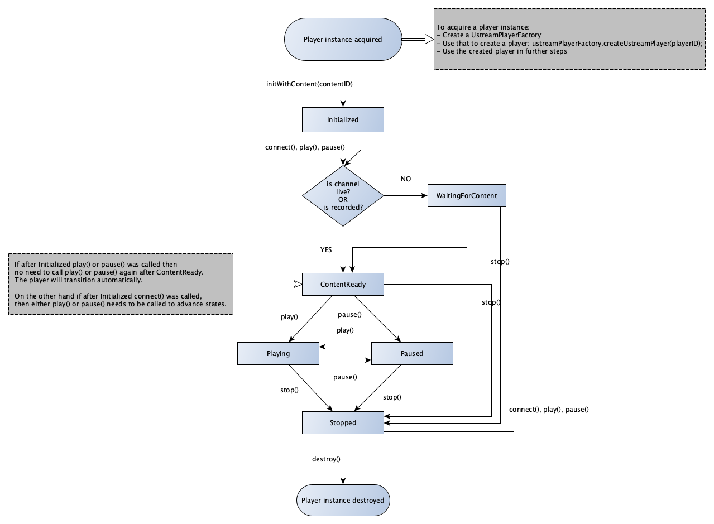

## Step 1: Create credentials for your mobile app

The SDK requires a **Mobile Player SDK Access** to be already set up on the [Dashboard]'s ["API/SDK access"] page
in order to be able to playback your own content in your application.
The access comprises of the following:
- **IBM Video Streaming Player SDK key** which is generated on the dashboard.
- **Google Play Package Name** which is the unique identifier of your application and must be set on the dashboard.
- **Key Hash**(es) of your application; the fingerprint of the signature's public key which was used to sign the app.
This must also be set on the dashboard and it is only Android specific. See [Generate your Key Hash](#generate-your-key-hash) on how to obtain these.

The detailed steps of how to register this access will be discussed further below in this document.

**Please note** that a *Mobile Player SDK Access* always belong to the specific IBM Video Account it was created for, thus such access will only enable playback
from Channels and of VODs that belong to that particular account. If you wish to play back content from different accounts you'll need multiple accesses.
Using these accesses in parallel -- that is accessing multiple accounts at once -- in one application is possible however might be inconvenient.
Please [contact us] if your use-case relies on this heavily.

The sample application contains a sample SDK key -- it has a preconfigured Player SDK access -- which you can use for testing. The sample SDK key
can only be used to play content on the test channel(s) also used in the sample app.

Every time you create an instance of the `PlayerFactory` you must use your **IBM Video Streaming Player SDK key**,
but the **Google Play Package Name** and **Key Hash** will be filled automatically.
These values are validated whenever the SDK communicates with IBM's Video Streaming streaming servers.

Before you can download and start using the _IBM Video Streaming Player SDK for Android_ for playing content from your own channel(s), you will need 
to register the **Key Hash** of every app in which you will integrate the _IBM Video Streaming Player SDK for Android_.
Every registered application will have its own _IBM Video Streaming Player SDK key_. Although there is a provided SDK key for the sample 
app's sample content, you still need to register your **Key Hash** at IBM Video Streaming. This will ensure that you can build the sample 
project using your own certificates.

### Generate your Key Hash

There are three types of certificates that your application can be signed with.
Each certificate generates a different **Key Hash**.

*   The **debug key** is used for development and testing (debug build).
*   The **release key** (or App Signing key) is used to sign your app when you release it to the Google Play Store (release build).
*   (Optional) The third type has been recently introduced with **Google Play App Signing**.
Using this feature when you upload your release build to the Play Store Google will sign it again with your true release key.
Therefore, you must generate key hashes for all three of your keys (Debug key, Upload key, App Signing key - managed by Google).
For more information visit: [Google Play App Signing](https://support.google.com/googleplay/android-developer/answer/7384423)


There are two ways to generate your **Key Hash**:
* In your Android app:
    Execute this in a debug build **and** in a release build too:
    
    Starting with 1.3.0 you can use `com.ibm.video.android.player.android.SignatureUtil.keyHashFromContext(Context)`
    to generate or check your current Key Hash from your application. This method basically executes 
    the following lines without printing to the output:

    ```java
    String packageName = context.getPackageName();
    PackageInfo packageInfo = context.getPackageManager().getPackageInfo(packageName, PackageManager.GET_SIGNATURES);
    byte[] signature = packageInfo.signatures[0].toByteArray();
    MessageDigest messageDigest = MessageDigest.getInstance("SHA");
    String keyHash = Base64.encodeToString(messageDigest.digest(signature), Base64.NO_WRAP);
    System.out.println("Key Hash is: "+keyHash);
    ```

* Using the command line:
 
    - Install OpenSSL for your development platform.
    - Locate your `keystore_file` and replace `CERTIFICATION_ALIAS` with your alias below and execute the commands:
 
        ```
        keytool -exportcert -alias CERTIFICATION_ALIAS -keystore /path/to/keystore_file >your_company-debug.key
        openssl dgst -sha1 -binary your_company-debug.key | base64
        ```
        The output of the last command is your **Key Hash**. 
        
        Remember to generate the identifier for your release certificate's public key **and** every other debug certificate
        that your developers will use.

### Register credentials

* Log-in into your account, navigate to the [Dashboard] and select ["API/SDK access"] 
under the "Integrations & Apps" menu.

* In the "Mobile Player SDK" section, click on "Create new credentials" and provide a name for your application in the 
"Application name" field. Your credentials will be listed under the ["API/SDK access"] page based on this name.

* Select Android in the "Platform" drop-down. Enter your **Key Hash** and **Google Play Package Name** in the respective fields.

* After you have completed all fields, hit "Save" to generate your IBM Video Streaming Player SDK for Android credentials. Make sure that
the "Key Hash" and "Google Play Package Name" are introduced correctly.
If you accidentally saved wrong values, you can edit or delete your credentials,
but beware as this will break any existing applications relying on those credentials.

*If you're using the EU cluster you can create your access on the dashboard of the EU cluster.*

## Step 2: Download SDK package

After hitting "Save" in the "Create new credentials" step, you will see your credentials listed with the newly generated
**IBM Video Streaming Player SDK key**.

Click to the "Android Player SDK" link near the "Download" to download the zip archive containing the SDK package.

## Step 3: Explore the SDK package

The provided zip archive contains the sample Android application project for IBM Video Streaming Player SDK for Android. The sample 
application uses the Player SDK as an AAR dependency found in the `/m2repository` folder in the archive.

## Step 4: Create (or open) your project

Open the project that you would like to integrate the IBM Video Streaming Player SDK in.
Update the `AndroidManifest.xml` of your application with the following permission:

```xml
<uses-permission android:name="android.permission.INTERNET" />
```

## Step 5: Add the SDK to the project

Import from local repo: copy the `m2repository` folder to your project. In your project's `build.gradle` put the Player SDK
dependency:

```gradle
repositories {
    maven {
        name 'IBMLocal'
        url new File("${rootProject.rootDir.path}/m2repository").toURI()
    }
}

dependencies {
    implementation 'com.ibm.video.android.player:player-android-external:2.2.0'
}
```

You can find this in the sample application also, just copy those settings.

## Step 6: Create a Player

### In your layout .xml

Place a `PlayerView` in your layout:

```xml
<com.ibm.video.android.player.android.PlayerView
android:id="@+id/playerview"
android:layout_height="match_parent"
android:layout_width="match_parent" />
```

### In your Activity or Fragment

Create a `PlayerFactory` in your Activity or Fragment with the Activity's context:

```java
private final PlayerFactory playerFactory = new PlayerFactory(RegionalCluster.WORLD_WIDE, IBM_PLAYER_SDK_KEY, context);
```
This factory can be used to create or retrieve IBM Video Streaming Player instances.
IBM Video Streaming Players created for a specific `playerId` will be retained across configuration changes (like orientation change).
Requesting a player with the same `playerId` will create a new Player interface, but that interface will
belong to the same player instance. The previous player for the same id must be detached before attaching a new one.

In your Fragment's `onCreateView()` or Activity's `onCreate()` find your playerView and get a player instance from the factory:

```java
final PlayerView playerView = (PlayerView)findViewById(R.id.playerview);
Player player = playerFactory.createPlayer(playerId);
```
Where `playerId` can be:
- a constant String value if the Activity will only contain **one** player instance.
- a persisted String value for every player instance that the Activity contains. (saved in `onSaveInstanceState()` restored in `onCreate()`)

The `com.ibm.video.android.player.api.Player` class is the point where you can interface with the Player SDK. Its methods send
events to the player, and its states are observed through the listeners (see below). The `Player`'s methods are
explained further in its _Javadoc_.

## Step 7: Play live or recorded content

After the `player` is created, initialize it with a live or previously recorded video content. This will most likely be in your
Activity's `onCreate()` (Fragment's `onCreateView()`). A player instance can be initialized more than once with different 
content, but `connect()` or `play()` must be called in order to reconnect to the servers. The `connect()` method is
optional (a `play()` or `pause()` call will also handle it implicitly) though the player will respond to `play()` calls 
more quickly because it is already connected to IBM Video Streaming's servers.

First time initialization:

```java
// To play videos, use ContentType.RECORDED and the video id
ContentDescriptor contentDescriptor = new ContentDescriptor(ContentType.RECORDED, 54321);
```

```java
// To play live streams, use ContentType.LIVE and the channel id
ContentDescriptor contentDescriptor = new ContentDescriptor(ContentType.LIVE, 12345);
```

```java
if (!player.isInitialized()) {
    player.initWithContent(contentDescriptor);

    /*
    If the password (or birthday) is known in advance (and it is known to be required)
    it can be supplied here, for example:
    player.setPassword("super-secret");
    */
    player.connect();
}
```

Remember to define a string constant `IBM_PLAYER_SDK_KEY` with your actual **IBM Video Streaming Player SDK key**.

### Setting your listeners

To receive state changes and other events from the player you need to set listeners. There are mandatory and optional ones, 
but all listeners must be set prior to calling `player.attach()` on your player instance. This should
happen in the `onResume()` or `onStart()` callback of your `Activity` or `Fragment`. Calling `attach()` is an important step, this is where
your listeners and the player view is bound to the Player SDK. Forgetting to call this will cause the player to not render 
video on your `View`, and you will not receive any callback on your listeners.
Also, since version 0.9.0 this is the place to set your `PlayerView` to the IBM Video Streaming player.
The reason behind this is, now you can optionally pre-buffer your player by calling `player.pause()` without the need to add a `PlayerView`.
PlayerView can be set later, when it is appropriate. For example, a news feed like application's `PlayerView`s will be in a `RecyclerView`.

```java
@Override
protected void onResume() {
    super.onResume();
    player.setPlayerListener(playerListener);
    player.setErrorListener(errorListener);
    player.setProgressListener(progressListener);
    player.setViewerCountListener(viewerCountListener);
    player.setLogoClickListener(logoClickListener);
    player.setMetaDataListener(metaDataListener);
    player.setBufferingListener(bufferingListener);
    player.setPlayerView(playerView);
    player.attach();
}
```

You also need to call `player.detach()` in your Activity's or Fragment's `onPause()` or `onStop()` callback, so your views can
be recycled properly.

```java
@Override
protected void onPause() {
    player.detach();
    super.onPause();
}
```

See the next section and the sample application for more details.

### Changing content

Changing content on an already initialized player (Please note `detach()` and `attach()` must be called to properly 
reinitialize views):

```java
private void changeContent(ContentDescriptor nextContent) {
    player.detach();
    player.initWithContent(nextContent);
    player.connect();
    player.attach();
}
```

## Step 8: Handle Player callbacks

### State flow of the IBM Video Streaming Player SDK

This diagram represents the state flow of the Player SDK, the nodes are the states reported by the player, while the named edges
are events that can be sent to the player. There is a decision in the flow that happens automatically based on the content 
selected (live or recorded).




### Generic callbacks

There are eight different listeners that you can add to the Player SDK instance to receive callbacks. Some of these 
listeners are mandatory, others are optional, but each listener represents a group of functionalities of the Player SDK.

The eight listeners are:

*   PlayerListener **(mandatory)**
*   ErrorListener **(mandatory)**
*   BufferingListener
*   ProgressListener
*   ViewerCountListener
*   LogoClickListener
*   MetaDataListener
*   MediaTrackChangeListener

#### PlayerListener

The `PlayerListener` is the most important listener, this is also a mandatory one, you must provide it, or you will receive 
an exception. The Player SDK's state is observed through this interface.

```java
package com.ibm.video.android.player.api;

/**
* Observes the state of the content playback.
*
* All callbacks represent mutually exclusive states.
*/
public interface PlayerListener {

    /**
    * Called when the player is initialized.
    * This is the initial state, and this is the state the player
    * returns to after re-initialized with a new content.
    * The Player SDK is not connected to the internet in this state.
    */
    void onInitialized();

    /**
    * Called when the player is stopped.
    * This is the state the player returns to after a stop() or disconnect() call.
    * The Player SDK is not connected to the internet in this state.
    */
    void onStopped();
    
    /**
    * The requested live channel is not broadcasting, or the stream is not
    * available in a playable format.
    * Note: in this state, the player is still connected to IBM Video Streaming's servers,
    * waiting for the stream to become online.
    */
    void onWaitingForContent();

    /**
    * Called when everything is ready to play the requested content.
    * Note: At this point buffering of the content did not start yet
    */
    void onContentReady();

    /**
    * Called at playback paused or stopped.
    */
    void onPaused();

    /**
    * Called at playback start or restart.
    */
    void onPlaying();
}
```

#### ErrorListener

This is also a mandatory listener; the Player SDK reports all playback errors here. When an error occurs, the SDK will call
the corresponding callback, then it will return to the stopped state, notifying the application using
`PlayerListener.onStopped()`.

```java
package com.ibm.video.android.player.api;

/**
* Observes the errors that can possibly occur in the player.
*
* The callbacks are called when playback is not possible and each callback
* represent a reason for the playback error.
*/
public interface ErrorListener {
    /**
     * The requested recorded video is not available in a playable format.
     */
    void onContentNotPlayable();

    /**
     * The requested live channel or recorded video does not exist.
     */
    void onNoSuchContent();

    /**
     * The requested content requires a password authentication.
     */
    void onPasswordLock();

    /**
     * The requested content requires a HashLock authentication
     * or the provided Hash is invalid/expired.
     */
    @Deprecated
    void onHashLock();

    /**
     * The requested content can not be accessed in the current area.
     */
    void onGeoLock();

    /**
     * The requested content can not be accessed due to restrictions.
     */
    void onRestricted();

    /**
     * The provided IBM Video Streaming Player SDK key is invalid or this key is not authorized to
     * access this content.
     */
    void onInvalidApiKey();

    /**
     * The broadcaster's viewer hours are spent. Receiving this callback means
     * that Your clients will not be able to watch your streams at the moment.
     */
    void onViewerHourLimitLock();

    /**
     * The requested content requires Viewer Authentication
     * or the provided viewer authentication token is invalid/expired.
     *
     * @param authUrl   an address where the authentication is handled
     *
     * @see Player#setViewerAuthToken(String)
     */
    void onViewerAuthLock(String authUrl);

    /**
     * Connection error.
     */
    void onConnectionError();

    /**
     * Unknown error.
     */
    void onUnknownError();
}
```

#### BufferingListener

This is an optional listener, notifying the application about buffering starts and stops. The player will resume its 
previous operation when buffering is completed.

```java
package com.ibm.video.android.player.api;

/**
* Observes background network communication's state
*/
public interface BufferingListener {
    
    /**
    * Called when the player does not have enough video frame to continue
    * playing and it is started to download data from the server
    */
    void onBufferingStarted();
    
    /**
    * Called when the player is finished receiving data from the server
    * either if there is sufficient amount of data is received and the
    * playback is continued or an error occurred.
    */
    void onBufferingStopped();
}
```

#### ProgressListener

The `ProgressListener` provides information about the content's duration and progress. This is an optional listener. 
Duration and progress values are in milliseconds.

```java
package com.ibm.video.android.player.api;

public interface ProgressListener {
    void onPositionUpdated(long positionMs);
    void onDurationUpdated(long durationMs);
    void onDurationDisabled();
}
```

#### ViewerCountListener

The `ViewerCountListener` provides information about the content's audience (all-time viewers and current concurrent viewers). 
This is an optional listener.

```java
package com.ibm.video.android.player.api;

/**
* Provides information about the current and total viewer numbers
*/
public interface ViewerCountListener {

    /**
    * Update of current viewer number.
    * @param viewers number of current viewers, display this on your layout
    */
    
    void onCurrentViewersUpdated(long viewers);
    
    /**
    * Current viewers module is disabled, remove the indicator from your
    * layout.
    */
    void onCurrentViewersDisabled();
    
    /**
    * Update of total viewer number.
    * @param totalViewers number of all-time combined viewers, display this on
    * your layout.
    */
    void onTotalViewersUpdated(long totalViewers);
    
    /**
    * Total viewers module is disabled, remove the indicator from your
    * layout.
    */
    void onTotalViewersDisabled();
}
```

#### LogoClickListener

The displayed logo has been clicked; you should open the URL in the callback's parameter. This is an optional listener.

```java
package com.ibm.video.android.player.api;

import java.net.URI;

/**
* Observes the click of the logo of a branded channel.
*/
public interface LogoClickListener {

    /**
    * Called when the logo of the branded channel has been clicked.
    *
    * @param url The url which should be opened on a logo click.
    */
    void onLogoClick(URI url);
    
}
```

#### MetaDataListener

`MetaDataListener` provides updates of the content's meta data, the callback is called when the metadata becomes available.
This is an optional listener.

```java
package com.ibm.video.android.player.api;

/**
* Observes the metaData of the content
*/
public interface MetaDataListener {

    /**
    * Called when the content metadata becomes available
    * (title, category, etc...).
    */
    void onMetaData(MetaData data);
    
    /**
    * Called when the content's conversation settings become available.
    * @param data Holder for the IRC chat and SocialStream settings.
    */
    @Deprecated
    void onChatAndSocialStreamData(ChatAndSocialStreamData data);
}
```

#### MediaTrackChangeListener

An optional listener to observe track changes in the player (audio, video, text).

* `onMediaTracksChanged(MediaTrackGroupHolder mediaTrackGroups)`
        - called when the tracks become available or change during playback.
* `onVideoTrackSelectionChanged(@Nullable MediaTrackSelection trackSelection)`
        - called when the selected video track is changed
* `onAudioTrackSelectionChanged(@Nullable MediaTrackSelection trackSelection)`
        - called when the selected audio track is changed
* `onTextTrackSelectionChanged(@Nullable MediaTrackSelection trackSelection)`
        - called when the selected text (subtitle / closed caption) track is changed
* `onVideoFormatChanged(MediaFormat videoFormat)`
        - called when the video format of the selected video track is changed

The track selection can be controlled with following methods of `Player`:
* `selectTrackForRenderer(MediaTrack mediaTrack, @Nullable int[] selectedFormatIndices)`
        - selects the supplied media track on the appropriate renderer.
        The Formats identified with the `selectedFormatIndices`'s values will take part in the selection.
        The latter parameter can be used to filter specific format for the selection, e.g. HD only.
* `selectDefaultTrack(MediaTrack.TrackType trackType)`
        - Commands the appropriate renderer for the provided TrackType to switch to the default mediaTrack.
* `disableRenderer(MediaTrack.TrackType trackType)`
        - Commands the appropriate renderer for the provided TrackType to disable rendering.

For more details see javadoc in `MediaTrackChangeListener` and `Player` classes.

### Interactive callbacks

The `onStopped()` callback in `PlayerListener` indicate a full stop and disconnect from IBM Video Streaming's servers. If the disconnect 
happened due to an error, the appropriate callback of `ErrorListener` indicates the reason.
Some of these errors can be resolved by you or the user of your application.

Errors that can be resolved by user (or developer) interaction:

#### Password lock
The requested content requires a password. This is represented by receiving an `onPasswordLock()` callback.
After acquiring the password, call `player.setPassword(password);` then restart the playback by `player.play();`.

#### Hash lock (*deprecated*)
The requested content requires a valid hash token to be unlocked. This is represented by receiving an `onHashLock()` callback.
After authenticating with your Hash service ([old Viewer Authentication](../viewer-authentication-api-getting-started)) and receiving a hash,
call `player.setHash(hash);` then restart the playback by `player.play();`

*This feature is deprecated and it is scheduled to be removed in 2022 Q1. Please migrate to Viewer Authentication instead.*

#### Viewer Authentication
The requested content requires Viewer Authentication. This is represented by receiving
an `onViewerAuthLock(authUrl)` callback. Use the url provided in the `authUrl` parameter to determine
where to go to authenticate. After receiving the token, call `player.setViewerAuthToken(token)`
then restart the playback by (for example) `player.play();`.

Viewer Authentication is replacing "Hash lock". It is a modernised and hardened version of authentication.
Please migrate your code to this version. For more information on the flow please refer to the [Viewer Authentication API documentation].

### Transient errors
Some errors may occur only temporarily, these might be resolved by retrying the playback with the exact same parameters.

#### Connection Error
This is a network error, and it is represented by a call to `onConnectionError()`.
Connection errors can happen for various reasons, but most likely there is a problem with the internet connection,
(usually it is only temporary) you can try again later by calling: `player.play();`

The player will try to resolve most of the connection problems internally, but sometimes it is unable to do so.

#### Viewer Hour Limit lock
The broadcaster's viewer hours are spent. This user can not watch the stream at the moment,
try again by calling: `player.play();`

This error is presented by a call to `onViewerHourLimitLock()`.

#### Unknown Error
This indicates a problem that the Player SDK couldn't determine, (most likely only temporary)
try again by calling: `player.play();`

This error is presented by a call to `onUnknownError()`.

### Other errors
There are certain errors that could happen due to certain Account, Channel or Video configurations,
misconfiguration of the Player instance or even due to context related parameters (even geo location of the viewer).
These errors can not be resolved by the viewers nor will go away by themselves.

#### Invalid API Key
This is a misconfiguration of the Player SDK. The provided IBM Video Streaming Player SDK key is
not authorized to play this content. You need to create a new Player SDK Factory instance to provide
the correct key. The key needs to be set upon factory creation: `new PlayerFactory(RegionalCluster.WORLD_WIDE, IBM_PLAYER_SDK_KEY, context);`.

This error is presented by a call to `onInvalidApiKey()`.

#### No Such Content
This is a misconfiguration of the Player SDK. The requested live channel or recorded video does not exist.

This error is presented by a call to `onNoSuchContent()`.

#### Content Not Playable
The requested recorded video is not available in a playable format. The Player couldn't acquire a
format to play that this device supports.

This error is presented by a call to `onContentNotPlayable()`.

#### Geo lock
The requested content is not playable in the user's current geo location.
This can happen if account, channel or video specific restrictions have been applied on the [Dashboard].

This error is presented by a call to `onGeoLock()`.

#### General Restriction
There are security restrictions set for the channel, that do not enable the Player SDK to play
this content, or your channel has reached its maximum concurrent viewer number. The latter can be resolved by retrying
later, to resolve the former the channel's settings must be modified.

This error is presented by a call to `onRestricted()`.

All of these callbacks discussed in sections [Interactive callbacks](#interactive-callbacks),
[Transient errors](#transient-errors) and [Other errors](#other-errors) can be found in
`com.ibm.video.android.player.api.ErrorListener`.

[Viewer Authentication API documentation]: ../viewer-authentication-api-v2-getting-started
[Dashboard]: https://video.ibm.com/dashboard
["API/SDK access"]: https://video.ibm.com/dashboard/integrations/api-access
[CHANGELOG]: changelog
[contact us]: https://video.ibm.com/enterprise-video/contact
