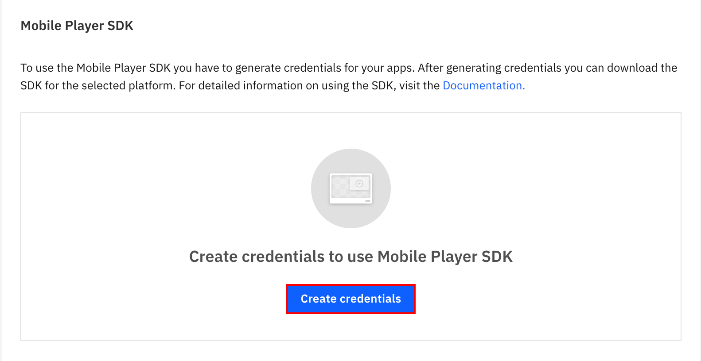
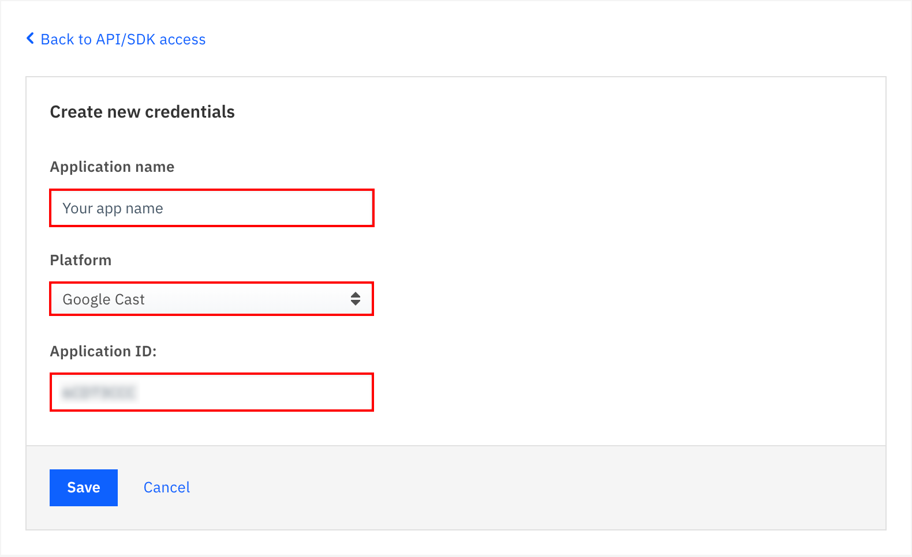
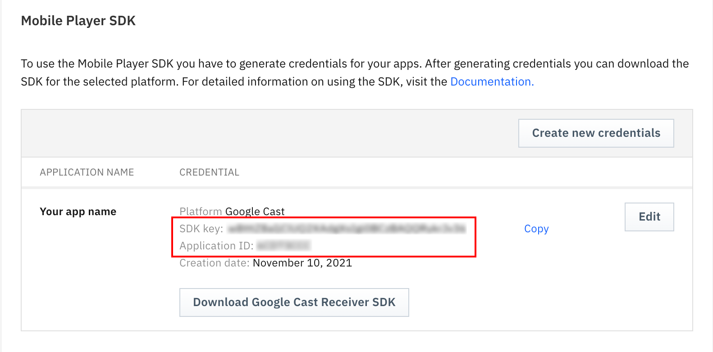
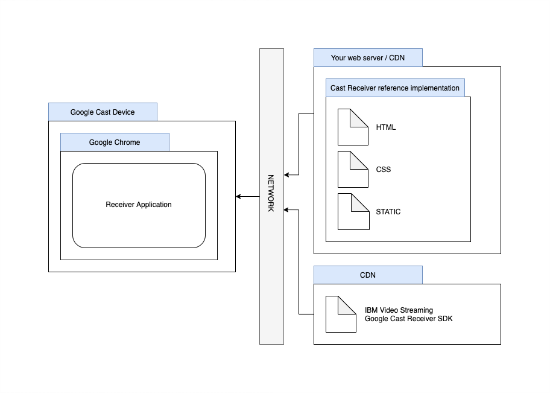

import { withPrefix } from 'gatsby-link';

## Create credentials

After logging into your account, find the [API/SDK access](https://video.ibm.com/dashboard/integrations/api-access) option under the **Integration & apps** menu item.

Under the **Mobile Player SDK** section, click on `Create credentials`.

<Row>
  <Column colLg={8}>



  </Column>
</Row>

Select `Google cast` from the Platform options. Fill out `Application name` with your prefered name.
Fill out `Application ID` with the identifier of your Google Cast Application. You can register a new Application [here](https://developers.google.com/cast/docs/registration).

<Row>
  <Column colLg={8}>



  </Column>
</Row>

After hitting `Save` you'll see your generated `SDK key`. Click on `Download Google Cast Receiver SDK` to download the archive.

<Row>
  <Column colLg={8}>



  </Column>
</Row>

## Contents of the archive

The downloaded archive is a reference implementation of a Google Cast [Styled Media Receiver], and has the following content:

- **receiver.html** _Includes SDKs, styles and fonts. Configures the Google Cast Receiver SDK._
- **css**
  - **receiver.css** _Specifies variables used to customize the cast receiver's UI._
- **static** _Assets referenced from receiver.css._

## Configure the SDK

Unzip the archive. Edit the `receiver.html` file, and
replace `applicationId` and `sdkKey` with corresponding values from the dashboard.

```javascript
<script>
  const config = {
    applicationId: '<your-application-id>',
    sdkKey: '<your-sdk-key>',
  };
  new IBMVideoStreaming.CastPlayer(config);
</script>
```

Serve the contents of the directory on a publicly accessible web server of your choice or upload it to a CDN.

<Row>
  <Column colLg={8}>



  </Column>
</Row>

Your Google Cast Application needs to know where to look for the resources of the customized receiver.

<InlineNotification>

In your **Google Cast Application**, make sure that the URL field points to the served receiver.html.

</InlineNotification>

The receiver SDK is ready to be used. Continue with customizing the receiver or set up the **Player SDK for Android** to be able to cast content and control the receiver.

## Next steps

<CardGroup>
  <MiniCard
    title="Customize the receiver"
    href={withPrefix('/player-sdk-cast/customization')}
  />
  <MiniCard
    title="Set up Player SDK for Android"
    href={withPrefix('/player-sdk-android/google-cast-support')}
  />
</CardGroup>

[Styled Media Receiver]: https://developers.google.com/cast/docs/styled_receiver